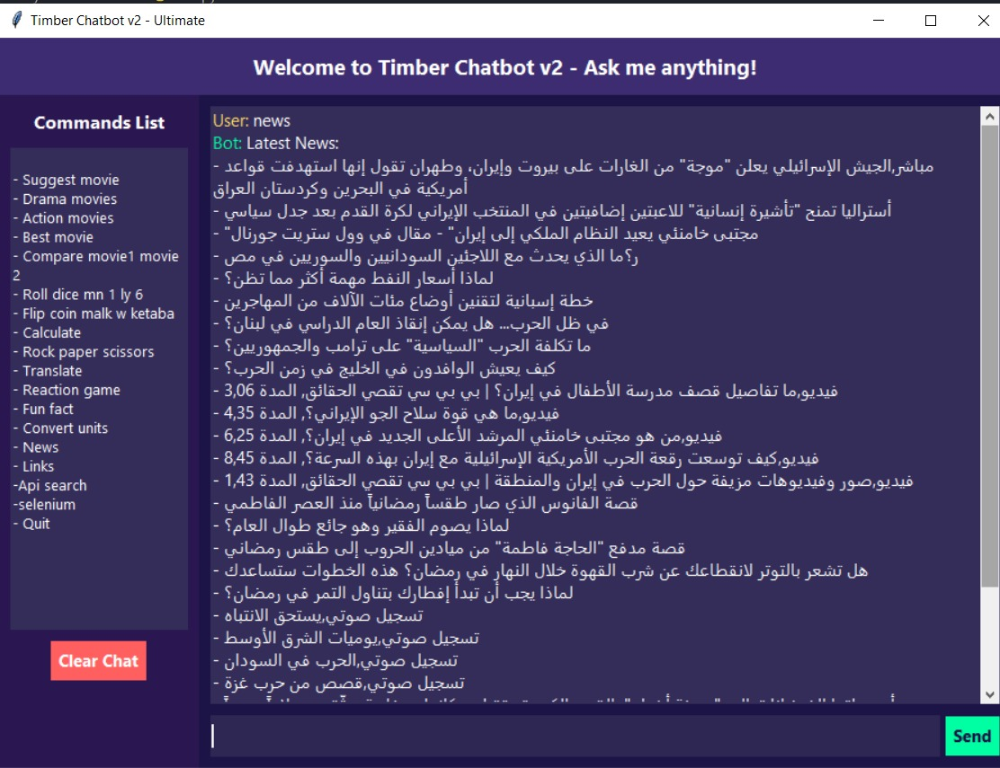

# Timber Chatbot v2

**Timber v2** is an improved version of the Timber v1 chatbot.  
It introduces modern data acquisition techniques, intelligent automation, and dynamic web searching to enhance information retrieval and user interaction.

The project integrates a graphical interface, automation tools, and multiple interactive features designed to create a versatile and intelligent assistant.

---

## Interface



---

## Features

### Movie Utilities
- Suggest movies by genre (Drama, Action, Top).
- Compare two movies.

### Fun Tools
- Roll a dice
- Flip a coin
- Rock–Paper–Scissors
- Reaction game
- Fun facts
- Unit conversion
- Simple calculator

### Search & Automation
- Google search using Selenium
- AliExpress product search
- AI image display
- Heatmap generation

### Data Handling
- Stores chatbot Q&A in `datastore.json`
- Uses `movies.json` for movie suggestions
- Logs conversations in `chat_log.txt`

---

## Technologies Used
- Python
- Tkinter (GUI)
- Selenium
- BeautifulSoup
- Requests
- Pyttsx3
- Pillow

---

## Requirements
Python **3.10+**

Install required packages:

```bash
pip install pyttsx3 pillow requests sympy beautifulsoup4 selenium deep-translator
```

Optional (for voice input):

```bash
pip install SpeechRecognition pyaudio
```

---

## How to Run

Clone the repository:

```bash
git clone https://github.com/your-username/Timber.git
```

Go to the project folder:

```bash
cd Timber
```

Run the program:

```bash
python Gui.py
```

---

## Notes
- Voice recognition requires `SpeechRecognition` and `PyAudio`.
- If voice input is not needed, you can comment out the related code in `Gui.py`.
- Conversations are stored in `chat_log.txt`.

---

## Team

This project was developed by:

- **Abdallah Bayoumy**
- **Omar Amr**
- **Nour Eldin Yasser**
